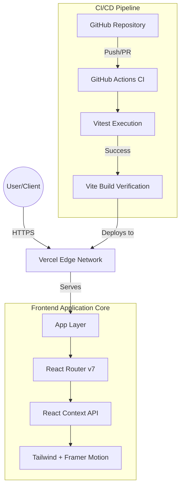

# 📦 Smart Inventory System (Frontend Demo)

[](https://github.com/jasenalfatamaa/smart-inventory-system/actions/workflows/ci.yml)
[](https://smartinv-sys.vercel.app/)

**SmartInv** is a modern, high-performance Smart Inventory Management System dashboard built as a standalone frontend demo. This project showcases a premium UI/UX, robust state management, and a production-ready CI/CD pipeline.

---

## 🏛️ System Architecture

The project follows a modern **Frontend-first** architecture designed for rapid deployment and high scalability.



---

## 🚀 Technical Stack

### Core Technologies
*   **Runtime**: React 19 (Latest stable features)
*   **Build Tool**: Vite (Ultra-fast development environment)
*   **Language**: TypeScript (Strong typing & maintainability)
*   **Styling**: Tailwind CSS (Utility-first design system)
*   **Animation**: Framer Motion (Fluid 60fps micro-interactions)

### Key Libraries
*   **State Management**: React Context API (Global inventory & auth state)
*   **Routing**: React Router DOM v7 (Data-aware routing)
*   **Validation**: Vitest + React Testing Library
*   **UI Components**: Lucide React & Sonner (Custom premium components)

---

## ✨ Key Features

*   📊 **Inventory Dashboard**: Real-time visualization of stock levels and movement logs.
*   📦 **Stock Control**: Full CRUD operations with automatic low-stock alerting systems.
*   🔐 **Auth Simulation**: Role-based access (Super Admin / Admin) with persistence.
*   💡 **Sticky UI**: Optimized navigation with sticky headers and responsive layouts.
*   🏗️ **Docker Ready**: Fully containerized environment with a built-in testing gate.
*   🧪 **100% Core Coverage**: Robust unit tests for all critical user flows.

---

## 📂 Project Structure

```text
frontend/
├── components/     # Reusable UI components (Sidebar, Navbar, Card, etc.)
├── pages/          # Full page layouts (Dashboard, Inventory, Login, etc.)
├── src/
│   ├── __tests__/  # Unit test suite (Vitest)
│   └── test/       # Test configuration and setup
├── context.tsx     # Global State Management (Auth & Inventory)
├── types.ts        # Shared TypeScript definitions
└── Dockerfile      # Multi-stage production build configuration
```

---

## 🛠️ Local Installation

1.  **Clone the repository**:
    ```bash
    git clone https://github.com/jasenalfatamaa/smart-inventory-system.git
    cd smart-inventory-system/frontend
    ```

2.  **Install dependencies**:
    ```bash
    npm install
    ```

3.  **Run Development Server**:
    ```bash
    npm run dev
    ```

4.  **Run Tests**:
    ```bash
    npm test
    ```

---

## ☁️ CI/CD & Production

The project implements a **zero-trust deployment** model:
1.  **Build Gate**: The `Dockerfile` and `ci.yml` both run `npm test` before allowing any build to proceed.
2.  **Quality Gate**: GitHub Actions verifies linting and code integrity.
3.  **Deployment**: Vercel automatically deploys the `main` branch only after CI status passes.

---

## 👤 Author

**Jasen Alfatama** - *Full Stack Developer* - [GitHub](https://github.com/jasenalfatamaa)

---

Developed with ❤️ as a high-fidelity frontend engineering demonstration.
