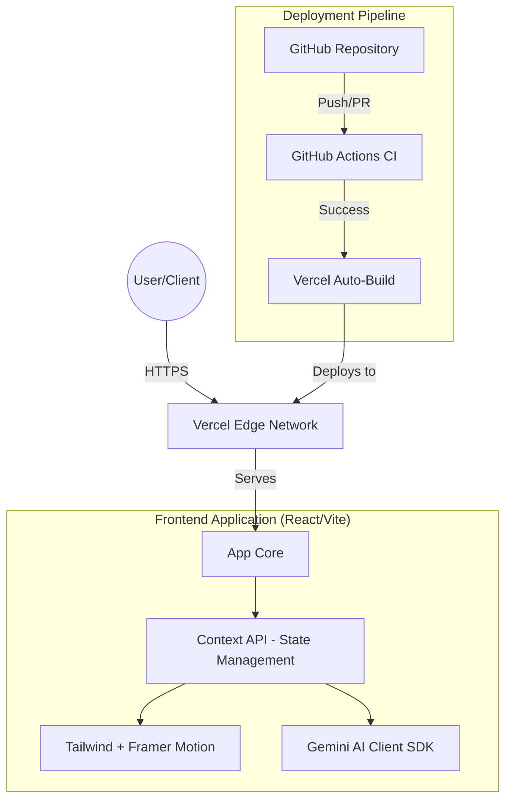

# 📦 Smart Inventory System (Frontend Demo)

[](https://github.com/jasenalfatamaa/smart-inventory-system/actions/workflows/ci.yml)
[](https://smart-inventory-system.vercel.app)

A modern, high-performance Smart Inventory Management System dashboard built as a standalone frontend demo. This project showcases a premium UI/UX, real-time data visualization, and AI-ready architecture.

---

## 🏛️ System Infrastructure

The project follows a modern **Frontend-first** architecture designed for rapid deployment and high scalability.



### Infrastructure Components:
*   **Hosting**: [Vercel](https://vercel.com) for Global Edge delivery and out-of-the-box CI/CD integration.
*   **CI Pipeline**: [GitHub Actions](https://github.com/features/actions) acting as a quality gate (Unit testing & Build verification).
*   **Version Control**: [GitHub](https://github.com) for source code management and collaborative development.

---

## 🚀 Technical Stack

### Core Technologies
*   **Runtime**: React 19 (Functional Components)
*   **Build Tool**: Vite (Lightning-fast HMR)
*   **Language**: TypeScript (Type-safe development)
*   **Styling**: Tailwind CSS (Utility-first CSS)
*   **Animation**: Framer Motion (Premium micro-interactions)

### Key Libraries
*   **State Management**: React Context API
*   **Routing**: React Router DOM v7
*   **Visualization**: Recharts (Interactive Dashboard Charts)
*   **Icons**: Lucide React
*   **Notifications**: Sonner (Rich toast notifications)

---

## ✨ Features

*   📊 **Real-time Dashboard**: Interactive charts for monitoring stock movements (In/Out).
*   📦 **Inventory Management**: CRUD operations for products with low-stock alerts.
*   🔐 **Protected Routing**: Role-based access control simulation (Admin / Super Admin).
*   💡 **Smart UI**: Sticky positioning for Navbar and optimized layouts for better productivity.
*   🤖 **AI Integrated**: Ready-to-use Gemini AI service for inventory analysis.
*   📱 **Responsive Design**: Fully optimized for mobile, tablet, and desktop viewports.

---

## 🛠️ Local Installation

1.  **Clone the repository**:
    ```bash
    git clone https://github.com/jasenalfatamaa/smart-inventory-system.git
    cd smart-inventory-system/frontend
    ```

2.  **Install dependencies**:
    ```bash
    npm install
    ```

3.  **Environment Setup**:
    Create a `.env` file in the `frontend` directory:
    ```env
    VITE_GEMINI_API_KEY=your_gemini_api_key_here
    ```

4.  **Run Development Server**:
    ```bash
    npm run dev
    ```

5.  **Run Tests**:
    ```bash
    npm test
    ```

---

## ☁️ CI/CD Workflow

The project uses a structured CI/CD pipeline defined in `.github/workflows/ci.yml`:

1.  **Test**: Runs `vitest` to ensure logic correctness.
2.  **Build**: Verifies that the project compiles correctly into production-ready assets.
3.  **Deploy**: Vercel monitors the success of the CI status and automatically redeploys to the production domain.

---

## 👤 Author

**Jasen Alfatama** - *Full Stack Developer* - [GitHub](https://github.com/jasenalfatamaa)

---

Developed with ❤️ primarily as a high-fidelity frontend demo.
